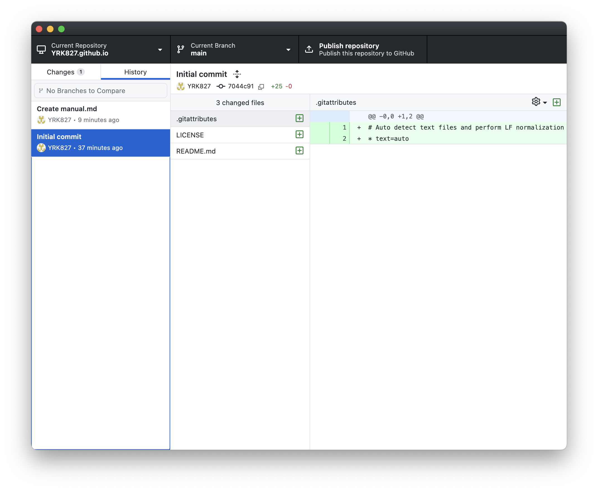

**How to Create a GitHub Repository**

1. Open GitHub Desktop
2. Create a Repository

   * Top left corner → Current Repository → Add → Create New Repository
   * Local path: The folder on your computer where the repository will be saved (remember this location)

     * If you forgot the location: Right-click the top left corner → Reveal in Finder →
   * README: A document that describes your repository. (It’s recommended to check it)
   * Git Ignore: Not yet covered in class.
   * License: Choose MIT License (allows anyone to use it)
3. Repository creation complete

   * A local repository has been created on your computer.
4. Upload to GitHub (Publish)

   * Top right corner → Publish repository

     * Keep this code private: Checked = private / Unchecked = public repository

---

local = your computer

remote = GitHub

push = upload from local → remote
pull = fetch from remote → merge into local

fetch = only fetch from remote → local (no merge)

[https://norlin.netlify.app/](https://norlin.netlify.app/) => full path, full URL
/home/docs/github => Absolute path
/docs/github/readme.md => absolute path with file name
{/docs/github/}img/image_00.png => `img/image_00.png` => relative path with file name

---

**Markdown**

* Insert image: 

  * ! = indicates an image in markdown (without it, it’s just a link)
  * [text] = image description
  * (image path) = relative path of the image to be inserted
  * ex: 
* Insert link: [text][URL]

  * Creates a hyperlink (external link = full path)
  * ex: [google](https://www.google.com)
* Internal page scroll: [name](# path)

  * Scrolls to a specified section
  * ex: [test](#GitHub)

[GitHub_Markdown_Syntax](https://gist.github.com/ihoneymon/652be052a0727ad59601)

---

**Commit & Push**

1. Go to the local folder and create a new file
2. In GitHub Desktop, check the “Changes” tab — the new file will appear
3. Commit

   * Write a message in the Summary field (summary of your commit)
   * Click “Commit to main” (save the file before committing)
   * Commit: Like creating a “save point” that records the current state
4. Reflect changes on GitHub (push)

   * Why? Because committing only saves it on your computer. Pushing copies it to the remote repository.
   * Top right → Push origin
   * You’ll see your file uploaded on the GitHub website

---

**Branch (Independent workspace separate from main)**

* Especially when working with a team:

  * If everyone works directly on main, conflicts like overwriting each other’s code may occur → branch prevents this
  * Each teammate works on their own branch → later merged
  * Changes don’t directly affect main

[Create a Branch]

1. Top bar → Current Branch → New Branch
2. If one or more branches already exist, choose where to branch from

   * Choose main: create a new branch from main
   * Choose (name) branch: create a new branch from the selected branch
3. Once created, you can freely work in your branch
4. Upload to GitHub

   * Top right → Publish branch
   * The branch will be created on remote (GitHub web)

---

**Workflow**

1. GitHub Desktop

   1. Check repository

      * Make sure it’s the correct repo containing the files you want to edit
      * Check that remote and local are in sync
   2. Check branch

      * Choose which branch to work in
      * If you work in the wrong branch, you’ll have to move or fix it later
